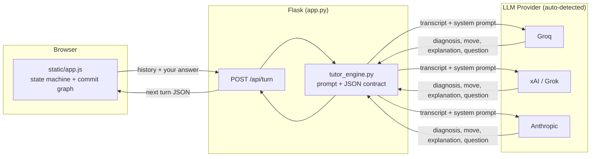

<div align="center">

# 🧭 Adaptive Tutor — Python Functions

**An AI tutor that reads how you answer, not just what you answer — and changes course accordingly.**

Built for **Rebuild the Classroom**, hosted by LV8 Tech.


### 🔗 [**Try it live →**](https://adaptive-tutor-1gyq.onrender.com)

*(Hosted on Render's free tier — the first request after inactivity can take 30–50 seconds to wake the server up. That's expected, not a bug.)*

</div>

---

## What this is

Most "AI in education" is a chatbot bolted onto a textbook: same content, same order, for every student. This isn't that.

This tutor teaches exactly **one subject, deeply — Python functions** (definition, parameters vs. arguments, return values, scope, and the mutable-default-argument gotcha) — and on every single turn, an LLM call decides, live, what you specifically need next:

| Move | What it means |
|---|---|
| 🟦 **slow down** | You're close but shaky — re-teach the same idea, smaller step |
| 🟥 **reframe** | You have a specific misconception — same idea, different mental model |
| 🟨 **jump ahead** | You've got it — raise difficulty or move to the next concept |
| ⬜ **probe** | Your answer is too vague to diagnose — ask before teaching more |

The model has to **state a diagnosis before it's allowed to teach anything.** That's not decoration — it's what forces two students who get the same question wrong for *different reasons* to actually get different explanations next, not the same one said more slowly.

The sidebar renders your session as a **commit graph** — one node per turn, colored by the move the tutor made — so the shape of your own adaptive path is visible as it happens, not hidden behind a progress bar.

---

## Table of contents

- [Quickstart](#quickstart)
- [How it works](#how-it-works)
- [Architecture](#architecture)
- [Project structure](#project-structure)
- [Design decisions](#design-decisions)
- [What's deliberately left out](#whats-deliberately-left-out)
- [Extensibility](#extensibility)
- [License](#license)

---

## Quickstart

Works with **any one** of a Groq key, an xAI (Grok) key, or an Anthropic key — set whichever one you have and the app detects it automatically.

> ⚠️ **Groq and xAI are different companies**, despite the similar names. A Groq key looks like `gsk_...` and only works with `GROQ_API_KEY`. An xAI key looks like `xai-...` and only works with `XAI_API_KEY`. Don't combine the two.

**macOS / Linux**
```bash
git clone https://github.com/sa7028894-arch/Adaptive-tutor.git
cd Adaptive-tutor
pip install -r requirements.txt
export GROQ_API_KEY=gsk_...   
python app.py
```

**Windows (cmd.exe)**
```bat
git clone https://github.com/sa7028894-arch/Adaptive-tutor.git
cd Adaptive-tutor
pip install -r requirements.txt
set GROQ_API_KEY=gsk_...
py app.py
```

Then open **http://localhost:5000**.

<details>
<summary>Optional environment variable overrides</summary>

| Variable | Purpose | Default |
|---|---|---|
| `TUTOR_MODEL_GROQ` | Groq model to use | `openai/gpt-oss-120b` |
| `TUTOR_MODEL_XAI` | xAI/Grok model to use | `grok-4-fast` |
| `TUTOR_MODEL` | Anthropic model to use | `claude-sonnet-5` |
| `PROVIDER` | Force `groq`, `xai`, or `anthropic` if more than one key is set | auto-detected |

</details>

---

## How it works

1. The frontend keeps the **entire transcript** of the session in memory — every explanation the tutor gave, every question it asked, every answer you typed.
2. On every turn, the full transcript is sent to the backend, which sends it to the model with a system prompt that forces a strict contract: **diagnose first, then pick exactly one move, then teach.**
3. The model returns structured JSON — diagnosis, move, concept, explanation, question, and a running mastery estimate per concept.
4. The frontend renders the explanation/question and appends a node to the commit graph.
5. Repeat until the model judges mastery is high enough across all five concepts, or that you've plateaued (in which case it says so honestly rather than padding the session).

There is **no server-side session store and no browser storage** — refreshing the page starts a fresh session on purpose, and the whole state lives in that one request/response cycle.

---

## Architecture




## Project structure


adaptive-tutor/
├── app.py              # Flask routes: serves the page, handles POST /api/turn
├── tutor_engine.py      # The actual educational logic + provider calls (Groq / xAI / Anthropic)
├── requirements.txt     # Just Flask — the engine uses only Python's stdlib for API calls
├── templates/
│   └── index.html       # Page shell
├── static/
│   ├── app.js            # Client-side state machine, rendering, commit graph
│   └── style.css         # Terminal-monospace teaching chrome + serif teaching voice
├── LICENSE
└── README.md
```


## Design decisions

**Why Python functions, specifically?** It's a small area with well-known, well-shaped misconceptions — confusing `return` with `print`, believing a function call permanently mutates a variable, tripping over the mutable-default-argument gotcha — which gives the adaptivity real terrain to work with in one sitting. Depth over breadth, per the brief.

**Why a commit graph, not a progress bar?** The whole premise is that the tutor *branches* based on you. A linear progress bar hides that; a graph of colored nodes makes the branching the visual itself — and it's a metaphor programmers already carry around in their heads.

**Why force a diagnosis before teaching?** Without it, it's easy for a model to just re-explain the same thing in slightly different words and call that "adaptive." Making the model commit to a move — and a reason — up front is what keeps `reframe` honest: it has to be a genuinely different mental model, not a rewording.

---

## What's deliberately left out

- No accounts, no persistence across sessions, no saved progress — scope stayed on depth in one subject for one sitting, per the brief.
- No hint system or partial-credit scoring — `mastery_estimate` is the model's live belief, not a graded score.
- No authoring tool for other subjects yet (see [Extensibility](#extensibility) for what that would take).

## Extensibility

The four-move contract (`slow_down` / `reframe` / `jump_ahead` / `probe`) and the JSON schema in `tutor_engine.py` aren't specific to Python functions. Swapping the `CONCEPTS` list and the subject description in `SYSTEM_PROMPT` is enough to retarget the same engine at a different topic — the commit-graph frontend and mastery bars need no changes to follow along.

## License

MIT — see [LICENSE](./LICENSE).
